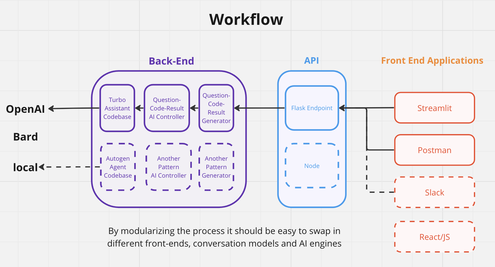

# mercury-be



## How to Test Local
1. Spin up flask server locally. `cd` into top of repo and run 
```
flask --app app run
```
This should create a server at url `http://127.0.0.1:5000/`

2. Ping Flask API with cUrl command: 
```
curl --request POST \
  --url http://127.0.0.1:5000/promptAI \
  --header 'Content-Type: application/json' \
  --header 'User-Agent: insomnia/8.3.0' \
  --data '{
	"prompt": "How many users saw an ad?"
}'
```