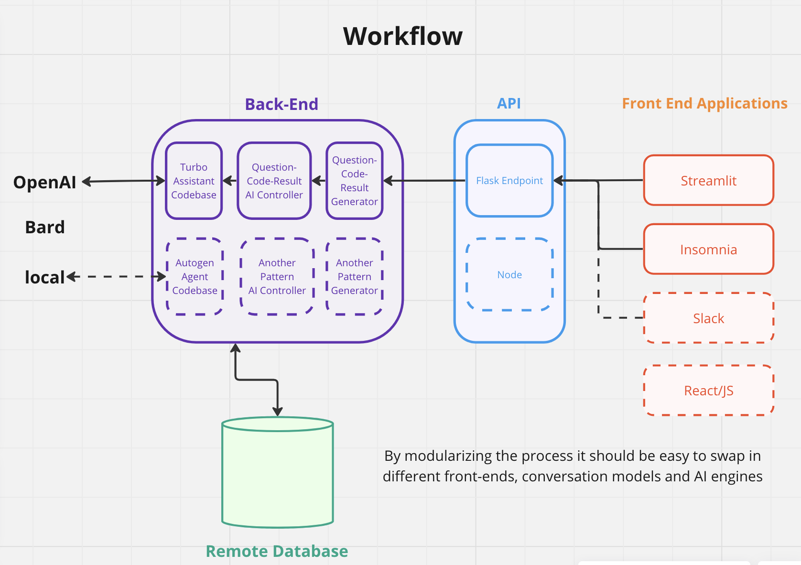

# Prompt Performance for AdTech Calculations
An evaluation of the performance of good, bad and enhanced AI prompts for typical adtech measurements.
## Introduction
AI agents and assistants are now capable of writing analytic code. Companies like Open AI, Meta and Google host their latest LLMs and offer APIs to work with them. It is very easy to prompt these tools with analytics questions and receive back code scripts that execute
and return results from datasets.

However, there is no guarantee that the code provided by LLMs provides an answer to the envisioned question of the requestor.

For this report we look at some common adtech measurements on a toy dataset. We compare the performance of different prompts in increasingly complex measurement tasks with a focus on trying to improve the performance of the LLM by appending hints to the prompt. The goal is to find important hints that will turn a bad prompt into a good one.
### Workflow
The software stack used for this example follows a traditional front-end / back-end architecture. 

For this analysis the front-end was replaced with a jupyter notebook so we could quickly iterate over different approaches.


### Dataset

Three tables of fake data were generated using `rand` in python/numpy and also using ChatGPT to generate names when needed.

There are three tables in the Postgres database (currently hosted on Render).

1. A `universe` table:

| idx   |   userid |   weight | gender   |
|-------|----------|----------|----------|
|  0    |        1 |        1 | F        |
|  1    |        2 |        1 | M        |
|  2    |        3 |        1 | M        |
|  3    |        4 |        1 | M        |

2. A `conversions` table:

|    |   conversionid |   userid | conversindate   |   conversionamt |
|---:|---------------:|---------:|:----------------|----------------:|
|  0 |              1 |     7281 | 2023-08-12      |       16.6145   |
|  1 |              2 |     8138 | 2023-08-07      |       11.4012   |
|  2 |              3 |     2510 | 2023-08-10      |       18.8951   |
|  3 |              4 |     9444 | 2023-09-25      |        0.108674 |

3. A `exposures` table:

|    |   exposureid |   userid | exposuredate   | propertyname        | creativename                | daypart         | exposuretype   |
|---:|-------------:|---------:|:---------------|:--------------------|:----------------------------|:----------------|:---------------|
|  0 |            1 |     8237 | 2023-09-20     | Showtime            | Bobs Burger Bash            | Daytime         | DigitalVideo   |
|  1 |            2 |     6231 | 2023-08-04     | NBCSN               | Bobs Best Burgers           | Late Night      | LinearTV       |
|  2 |            3 |     3712 | 2023-08-25     | Cinemax             | Bobs Best Burgers           | Early Fringe    | StreamingApp   |
|  3 |            4 |     5832 | 2023-09-16     | Discovery Channel   | Bite into Bobs              | Late Night      | LinearTV       |
|  4 |            5 |      144 | 2023-09-26     | Lifetime            | Bobs Best Burgers           | Daytime         | SocialMedia    |
|  5 |            6 |     6263 | 2023-09-15     | Syfy                | Delicious Burgers On-the-Go | Daytime         | SocialMedia    |

### Pipeline
1. The user writes a prompt
2. The backend enhances the prompt
3. An AI Assistant is instantiated and instructed to write performant python
4. The AI Assistant is provided the enhanced prompt and asked to generate a python script to answer the user-provided question
5. The AI-produced python script is run and the results are evaluated.

### Prompt Template
```
Write a python script that will print an answer the QUESTION. 
The script should write the answer to a csv file called ANSWER_9.csv

QUESTION:

{Question}

The data you need to execute the task can be found in a postgres database with TABLE_DEFINITIONS described below.

TABLE_DEFINITIONS

CREATE TABLE campaign.universe (userid integer, weight integer, gender text);
 Sample Data for universe:
|    |   userid |   weight | gender   |
|---:|---------:|---------:|:---------|
|  0 |        1 |        1 | F        |
|  1 |        2 |        1 | M        |
|  2 |        3 |        1 | M        |
|  3 |        4 |        1 | M        |
|  4 |        5 |        1 | F        |
|  5 |        6 |        1 | F        |
|  6 |        7 |        1 | M        |
|  7 |        8 |        1 | M        |
|  8 |        9 |        1 | M        |
|  9 |       10 |        1 | M        |

CREATE TABLE campaign.conversions (conversionid integer, userid integer, conversindate date, conversionamt double precision);
 Sample Data for conversions:
|    |   conversionid |   userid | conversindate   |   conversionamt |
|---:|---------------:|---------:|:----------------|----------------:|
|  0 |              1 |     7281 | 2023-08-12      |       16.6145   |
|  1 |              2 |     8138 | 2023-08-07      |       11.4012   |
|  2 |              3 |     2510 | 2023-08-10      |       18.8951   |
|  3 |              4 |     9444 | 2023-09-25      |        0.108674 |
|  4 |              5 |     9450 | 2023-08-18      |       13.6739   |
|  5 |              6 |     6683 | 2023-08-25      |       17.0937   |
|  6 |              7 |     3964 | 2023-10-27      |        2.09294  |
|  7 |              8 |     8710 | 2023-09-07      |        2.36097  |
|  8 |              9 |      311 | 2023-08-20      |        0.45382  |
|  9 |             10 |     7562 | 2023-08-06      |        4.21386  |

CREATE TABLE campaign.exposures (exposureid integer, userid integer, exposuredate date, propertyname text, creativename text, daypart text, exposuretype text);
 Sample Data for exposures:
|    |   exposureid |   userid | exposuredate   | propertyname        | creativename                | daypart         | exposuretype   |
|---:|-------------:|---------:|:---------------|:--------------------|:----------------------------|:----------------|:---------------|
|  0 |            1 |     8237 | 2023-09-20     | Showtime            | Bobs Burger Bash            | Daytime         | DigitalVideo   |
|  1 |            2 |     6231 | 2023-08-04     | NBCSN               | Bobs Best Burgers           | Late Night      | LinearTV       |
|  2 |            3 |     3712 | 2023-08-25     | Cinemax             | Bobs Best Burgers           | Early Fringe    | StreamingApp   |
|  3 |            4 |     5832 | 2023-09-16     | Discovery Channel   | Bite into Bobs              | Late Night      | LinearTV       |
|  4 |            5 |      144 | 2023-09-26     | Lifetime            | Bobs Best Burgers           | Daytime         | SocialMedia    |
|  5 |            6 |     6263 | 2023-09-15     | Syfy                | Delicious Burgers On-the-Go | Daytime         | SocialMedia    |
|  6 |            7 |     8011 | 2023-08-29     | Smithsonian Channel | Bobs Flippin Good Burgers   | Early Fringe    | StreamingApp   |
|  7 |            8 |     9422 | 2023-08-24     | Hallmark Channel    | Bobs Flippin Good Burgers   | Afternoon Drive | DigitalVideo   |
|  8 |            9 |     8569 | 2023-09-05     | Lifetime            | Bobs Flippin Good Burgers   | Prime Time      | StreamingApp   |
|  9 |           10 |      399 | 2023-09-30     | National Geographic | Bobs Flippin Good Burgers   | Morning Drive   | StreamingApp   |

 Finally, to connect to the postgres database with the datasets you need to answer this QUESTION you can use the following environmental variables:
host: RENDER_PG_HOST
database: RENDER_PG_NAME
username: RENDER_PG_USER
password: RENDER_PG_PASSWORD. 

You should assume these variables are in the environment of the python script and can be accessed with the os library.)
```
## Reach Prompt Performance
Three prompts were tested and evaluated for correctness. The goal is to prompt AI to write a python script that executes a query against the database and determines that the total reach of the campaign was 9,999 users.

The three tested are prompts are

1. >How many users saw an ad?

2. >What is the total reach of the campaign?
3. <blockquote> What is the total reach of the campaign?  
   
   Here is a hint you can use to help answer 
   the QUESTION. The total reach of an 
   advertising campaign is determined by 
   counting the number of distinct users who 
   saw an ad.
   </blockquote>

### Results
| Prompt | Total Runs | Answer Returned | Correct Answer |
|--------|------------|-----------------|----------------|
| How many users saw an ad? | 20 | 19 | 19 (95%) |
| What is the total reach of the campaign? | 20 | 20 | 4 (20%) |
| What is the total reach of the campaign?  **Here is a hint you can use to help answer the QUESTION. The total reach of an advertising campaign is determined by counting the number of distinct users who saw an ad.** | 20 | 20 | 20 (100%) |

### What Went Right/ Wrong?*

**(Typical) Good SQL Answer**
```
SELECT 
    COUNT(DISTINCT userid) 
FROM 
    campaign.exposures
```

**Bad SQL Answers**
```
SELECT 
    SUM(weight) AS total_reach
FROM 
    campaign.universe
```
```
SELECT 
    SUM(DISTINCT weight) 
FROM 
    campaign.universe u 
JOIN 
    campaign.exposures e 
ON 
    u.userid = e.userid
```

## Time Series Reach
**Prompts:**
1. > Please report daily campaign reach where reach for a given day is defined to be total number of users who were exposed in the previous 7 day window. Perform the calculation for each day from August 1 2023 to September 1 2023

2. > Please calculate daily campaign reach. Use a 7 day lookback window when determining the reach for a given day. Perform the calculation for each day from August 1 2023 to September 1 2023

3. > Please report daily campaign reach from August 1 2023 to September 1 2023 with a 7 day lookback window.
**Here are some generalized hints you can use to help answer the QUESTION.
HINT 1: When a user asks for reach with an n-day lookback window you should determine how many users saw an ad during the previous n days 
HINT 2: The BETWEEN SQL function is inclusive of its bounds. That means that when using BETWEEN for an n day window calculation you should use n-1 days in the calculation.**

### Results
| Prompt | Total Runs | Answer Returned | Correct Answer |
|--------|------------|-----------------|----------------|
| Please report daily campaign reach where reach for a given day is defined to be total number of users who were exposed in the previous 7 day window. Perform the calculation for each day from August 1 2023 to September 1 2023 | 20 | 17 | 6 (30%) |
| Please calculate daily campaign reach. Use a 7 day lookback window when determining the reach for a given day. Perform the calculation for each day from August 1 2023 to September 1 2023 | 20 | 19 | 2 (10%) |
| - | 20 | - | - |
### Analysis of Responses

**Correct Answer:**

```python
import os
import psycopg2
import csv
from datetime import datetime, timedelta

# Environmental variables
host = os.getenv('RENDER_PG_HOST')
database = os.getenv('RENDER_PG_NAME')
username = os.getenv('RENDER_PG_USER')
password = os.getenv('RENDER_PG_PASSWORD')

# Connect to the PostgreSQL database
conn = psycopg2.connect(host=host, database=database, user=username, password=password)
cur = conn.cursor()

# Define the date range
start_date = datetime(2023, 8, 1)
end_date = datetime(2023, 9, 1)

# Open the CSV file to write the results
with open('ANSWER_1.csv', mode='w') as csv_file:
    writer = csv.writer(csv_file)
    writer.writerow(['date', 'reach'])

    # Iterate over each day in the date range
    for single_date in (start_date + timedelta(n) for n in range((end_date - start_date).days)):
        # Define the 7-day window as a date range
        window_start = single_date - timedelta(days=6)
        window_end = single_date

        # Build SQL to query unique user count in the 7-day window considering exposures
        query = """
        SELECT COUNT(DISTINCT e.userid) AS reach
        FROM campaign.exposures e
        WHERE e.exposuredate BETWEEN %s AND %s
        """

        # Execute the query with date parameters
        cur.execute(query, [window_start.date(), window_end.date()])
        reach = cur.fetchone()[0]

        # Write the date and total reach to CSV
        writer.writerow([single_date.date(), reach])

# Close the database connection
cur.close()
conn.close()
```

A common mistake made by AI is to measure with an 8
day lookback window. Because the `BETWEEN` clause in
SQL is inclusive this type of logic leads to too large
of a window
```python
seven_days_ago = current_date - timedelta(days=7)

# Execute query to count unique users in the 7-day window
with conn.cursor() as cursor:
    cursor.execute("""
        SELECT COUNT(DISTINCT userid) as reach
        FROM campaign.exposures
        WHERE exposuredate BETWEEN %s AND %s
    """, (seven_days_ago, current_date))
    reach_count = cursor.fetchone()[0]
```

Another VERY common mistake is the AI includes the 
exposuredate in the query and performs a `GROUP BY`
on it: 
```sql
SELECT exposuredate, COUNT(DISTINCT userid) AS reach
FROM campaign.exposures
WHERE exposuredate BETWEEN %(start_date)s AND %(end_date)s
AND userid IN (
    SELECT DISTINCT userid
    FROM campaign.exposures
    WHERE exposuredate BETWEEN %(lookback_start)s AND %(lookback_end)s
)
GROUP BY exposuredate
ORDER BY exposuredate
```

Another mistake that AI makes is that it tries to
index by exposure date and ends up counting
distinct users reached only by the `current_date` day.

**Wrong Answer**
```python
        cur.execute("""
            SELECT DISTINCT DATE(exposuredate), COUNT(DISTINCT userid)
            FROM campaign.exposures
            WHERE exposuredate >= %s AND exposuredate < %s
            AND userid IN (
                SELECT DISTINCT userid
                FROM campaign.exposures
                WHERE exposuredate BETWEEN %s AND %s
            )
            GROUP BY DATE(exposuredate)
            ORDER BY DATE(exposuredate)
        """, (start_date, end_date, start_date - timedelta(days=7), start_date))
        return cur.fetchall()
```
